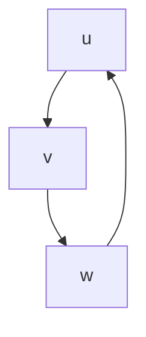
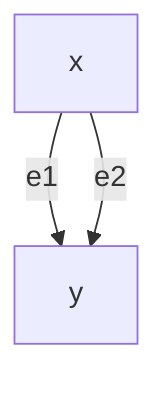
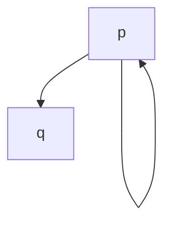
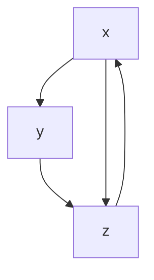
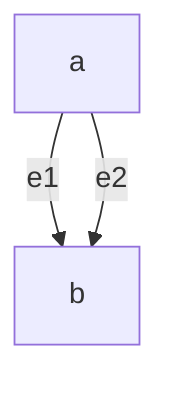
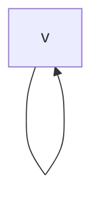
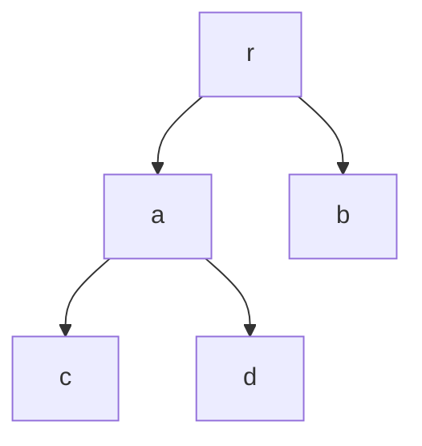

---

# **Graph Theory – Examples Only**

Este documento contiene **únicamente ejemplos**, organizados por tema, usando notación compatible con GitHub (MathJax + Mermaid).

---

# 1. Basic Concepts — Examples

## 1.1 Graphs, Digraphs, Multidigraphs, Pseudodigraphs

### **Example 1 — Simple Graph**
Vertices:  
$V = \{a, b, c, d\}$

Edges:  
$E = \{ab, ac, bd\}$

```mermaid
graph LR
    a -- b
    a -- c
    b -- d
```

---

### **Example 2 — Directed Graph (Digraph)**
Arcs:  
$A = \{(u,v), (v,w), (w,u)\}$



---

### **Example 3 — Multidigraph**
Two arcs from $x$ to $y$:



---

### **Example 4 — Pseudodigraph (with loop)**


---

# 2. Incidence and Adjacency — Examples

### **Example 5 — Incidence**
In the graph:

```mermaid
graph undirected
    u -- v
    v -- w
```

- Edge $uv$ is incident to $u$ and $v$.  
- Vertex $v$ is incident to edges $uv$ and $vw$.

---

### **Example 6 — Adjacency**
In the graph:

```mermaid
graph undirected
    a -- b
    b -- c
```

- $a$ and $b$ are adjacent.  
- Edges $ab$ and $bc$ are adjacent (share vertex $b$).

---

# 3. Degree of a Vertex — Examples

### **Example 7 — Degree in an Undirected Graph**
Graph:

```mermaid
graph undirected
    a -- b
    a -- c
    a -- d
    b -- c
```

Degrees:

- $\deg(a) = 3$  
- $\deg(b) = 2$  
- $\deg(c) = 2$  
- $\deg(d) = 1$

---

### **Example 8 — In-degree and Out-degree**
Digraph:



- $\deg^+(x) = 2$, $\deg^-(x) = 1$  
- $\deg^+(y) = 1$, $\deg^-(y) = 1$  
- $\deg^+(z) = 1$, $\deg^-(z) = 2$

---

# 4. Fundamental Theorems — Examples

### **Example 9 — Handshaking Lemma**
Graph:

```mermaid
graph undirected
    a -- b
    b -- c
    c -- a
    c -- d
```

Degrees:

- $\deg(a)=2$, $\deg(b)=2$, $\deg(c)=3$, $\deg(d)=1$

Sum:  
$2 + 2 + 3 + 1 = 8 = 2|E|$

Edges:  
$|E| = 4$

✔️ Satisface el lema.

---

### **Example 10 — Odd-degree Vertices**
Same graph as above:

Odd-degree vertices: $c, d$ → **2 vertices** → número par.

---

### **Example 11 — Havel–Hakimi**
Sequence:  
$(3, 3, 2, 2, 2)$

1. Remove 3 → subtract 1 from next 3 terms  
   → $(2, 1, 1, 2)$  
2. Sort → $(2, 2, 1, 1)$  
3. Remove 2 → subtract 1 from next 2 terms  
   → $(1, 0, 1)$  
4. Sort → $(1, 1, 0)$  
5. Remove 1 → subtract 1 from next 1 term  
   → $(0, 0)$

Sequence ends in all zeros → **graphical**.

---

# 5. Types of Edges — Examples

### **Example 12 — Parallel Edges**


---

### **Example 13 — Loop**


---

### **Example 14 — Edges in Series**
Path of length 2:

```mermaid
graph undirected
    a -- b
    b -- c
```

Edges $ab$ and $bc$ are in series.

---

# 6. Types of Graphs — Examples

### **Example 15 — Null Graph**
```mermaid
graph undirected
    a
    b
    c
```

---

### **Example 16 — Regular Graph (3-regular)**
```mermaid
graph undirected
    A -- B
    B -- C
    C -- D
    D -- A
    A -- C
    B -- D
```

---

### **Example 17 — Bipartite Graph**
```mermaid
graph LR
    subgraph U
        u1
        u2
    end
    subgraph V
        v1
        v2
    end

    u1 -- v1
    u1 -- v2
    u2 -- v1
```

---

### **Example 18 — Complete Graph $K_4$**
```mermaid
graph undirected
    A -- B
    A -- C
    A -- D
    B -- C
    B -- D
    C -- D
```

---

### **Example 19 — Tree**


---

### **Example 20 — Subgraph**
Original:

```mermaid
graph undirected
    a -- b
    a -- c
    b -- c
    c -- d
```

Subgraph using $V'=\{a,b,c\}$, $E'=\{ab,ac\}$:

```mermaid
graph undirected
    a -- b
    a -- c
```

---

# 7. Isomorphism — Examples

### **Example 21 — Two Isomorphic Graphs**

Graph $G$:

```mermaid
graph undirected
    a -- b
    b -- c
    c -- a
```

Graph $H$:

```mermaid
graph undirected
    1 -- 2
    2 -- 3
    3 -- 1
```

Isomorphism:  
$f(a)=1,\ f(b)=2,\ f(c)=3$

---

# 8. Walks, Paths, Circuits — Examples

### **Example 22 — Walk**
Walk:  
$a, b, c, b, d$

```mermaid
graph undirected
    a -- b
    b -- c
    b -- d
```

---

### **Example 23 — Path**
Path:  
$u, v, w, x$

```mermaid
graph undirected
    u -- v
    v -- w
    w -- x
```

---

### **Example 24 — Circuit**
Circuit:  
$p, q, r, p$

```mermaid
graph undirected
    p -- q
    q -- r
    r -- p
```

---