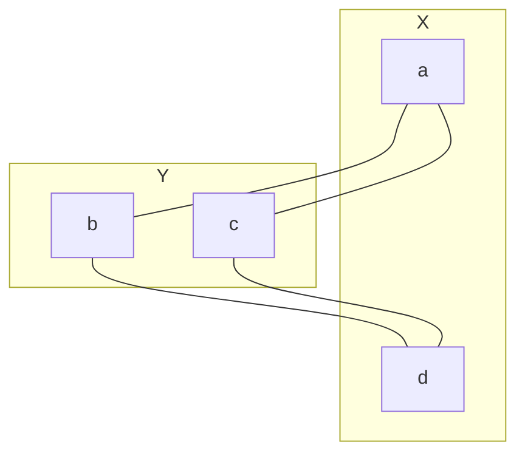

---

# **Graph Theory – Matrix Representations (Exercise Set)**

## **1. Adjacency Matrix**

### **1.1 Basic Computation**
1. Compute the adjacency matrix of the following graph:  
   $$
   V = \\{1,2,3,4\\},\quad E = \\{12, 23, 34, 14, 13\\}.
   $$

    $$
    M =
    \begin{pmatrix}
    0 & 1 & 1 & 1 \\
    1 & 0 & 1 & 0 \\
    1 & 1 & 0 & 1 \\
    1 & 0 & 1 & 0
    \end{pmatrix}
    $$

2. For the directed graph  
   $$
   A = \\{(1,2),(2,3),(3,1),(3,4)\\},
   $$
   construct the adjacency matrix.

   $$
    M =
    \begin{pmatrix}
    0 & 1 & 0 & 0 \\
    0 & 0 & 1 & 0 \\
    1 & 0 & 0 & 1 \\
    0 & 0 & 0 & 0
    \end{pmatrix}
    $$

3. Determine whether the following adjacency matrix corresponds to a simple graph, a multigraph, or a digraph:
   $$
   A =
   \begin{pmatrix}
   0 & 2 & 0 \\
   2 & 0 & 1 \\
   0 & 1 & 0
   \end{pmatrix}
   $$

   We can identify 2 in the matrix, this means there are parallel edges, therefore is a multigraph.

---

### **1.2 Walk Counting**
4. Let

   $$
   A =
   \begin{pmatrix}
   0 & 1 & 1 \\
   1 & 0 & 1 \\
   1 & 1 & 0
   \end{pmatrix}.
   $$

   Compute $A^2$ and interpret each entry.

    Using matrix multiplication

    $$
    A^2 =
    \begin{pmatrix}
    2 & 1 & 1 \\
    1 & 2 & 1 \\
    1 & 1 & 2
    \end{pmatrix}.
    $$
    

5. For the graph in Exercise 1, compute the number of walks of length 3 from vertex 1 to vertex 4.

    $$
    M =
    \begin{pmatrix}
    0 & 1 & 1 & 1 \\
    1 & 0 & 1 & 0 \\
    1 & 1 & 0 & 1 \\
    1 & 0 & 1 & 0
    \end{pmatrix}
    $$

    Then we must calculate $M^3$

    $$
    M =
    \begin{pmatrix}
    4 & 5 & 5 & 5 \\
    5 & 2 & 5 & 2 \\
    5 & 5 & 4 & 5 \\
    5 & 2 & 5 & 2
    \end{pmatrix}
    $$

    Since we only need the walks from 1 to 4, we take a look at $M_{1,4}^{3} = 5$

6. Prove that if $A$ is the adjacency matrix of a simple graph, then the diagonal entries of $A^2$ equal the degrees of the vertices.

By matrix product we have that the diagonal of the result is given by the formula

$$
A^2_{ii} = \sum_k a_{ik}a_{ki}
$$

since it is a simple graph it has no loops or parallel edges, then each entry can be either 1 or 0 with the consideration $a_{ii}=0$, This means $A^{2}[ii]=deg(v,i)$

---

### **1.3 Structural Analysis**
7. Determine whether the following graph is bipartite using its adjacency matrix:
   $$
   A =
   \begin{pmatrix}
   0 & 1 & 1 & 0 \\
   1 & 0 & 0 & 1 \\
   1 & 0 & 0 & 1 \\
   0 & 1 & 1 & 0
   \end{pmatrix}
   $$

Let $V=\\{a,b,c,d\\}$ we can notice $E = \\{ab, ac, bd, cd\\}$, if we pllot it 

Since we can connect all vertex from Graph X to the ones from graph Y, is bipartite

8. Show that a graph is regular of degree $k$ if and only if the all-ones vector is an eigenvector of its adjacency matrix with eigenvalue $k$.

Let $A$ be adjacency matrix of a $k$-regular graph.  
Let $\mathbf{1}$ be the all-ones vector.

Then each row of $A$ has exactly $k$ ones, so:

$$
A \mathbf{1} = k \mathbf{1}.
$$

Thus $\mathbf{1}$ is an eigenvector with eigenvalue $k$.

Conversely, if $A \mathbf{1} = k \mathbf{1}$, each row sum is $k$, so each vertex has degree $k$.
Hence the graph is $k$-regular.

---

## **2. Incidence Matrix**

### **2.1 Basic Construction**
9. Construct the incidence matrix of the graph:
   $$
   E = \\{ab, bc, cd, da, ac\\}.
   $$

    $$
    M =
    \begin{pmatrix}
    1 & 0 & 0 & 1 & 1 \\
    1 & 1 & 0 & 0 & 0 \\
    0 & 1 & 1 & 0 & 1\\
    0 & 0 & 1 & 1 & 0
    \end{pmatrix}
    $$

10. For the directed graph  
    $$
    A = \\{(1,2),(2,3),(3,4),(4,2)\\},
    $$
    construct the signed incidence matrix.

    $$
    M =
    \begin{pmatrix}
    -1 & 0 & 0 & 0 \\
    1 & -1 & 0 & 1 \\
    0 & 1 & -1 & 0 \\
    0 & 0 & 1 & -1
    \end{pmatrix}
    $$

---

### **2.2 Degree and Structure**
11. Using the incidence matrix from Exercise 9, compute the degree of each vertex.

$$
M =
\begin{pmatrix}
1 & 0 & 0 & 1 & 1 \\
1 & 1 & 0 & 0 & 0 \\
0 & 1 & 1 & 0 & 1\\
0 & 0 & 1 & 1 & 0
\end{pmatrix}
$$

$$
\deg(a)=3
\deg(b)=2
\deg(c)=3
\deg(d)=2
$$

12. Prove that for any simple graph with incidence matrix $M$:

$$
M M^{T} = D + A,
$$
    
where $D$ is the degree matrix and $A$ is the adjacency matrix.

$M M^{T}$ has the form $\sum_{k} m_{ik}m_{ki}$ which means the diagonal is the degree matrix, since the sum of the row of the incidence matrix equals the sum of the columns of the transpose.

Since we are supossing a simple graph, then we assume there are no loops, so the diagonal is $0$. Furthermore, the adjacency matrix shows the relationship between vertex, which is the same behavior $M M^{T}$ shows since $M$ is the relation between vertex and edges and $M^{T}$ the relation between edges and vertex and their product the relation vertex with vertex.

Thus $M M^{T} = D + A$

---

## **3. Accessibility (Reachability) Matrix**

### **3.1 Computation**
13. For the graph with adjacency matrix

    $$
    A =
    \begin{pmatrix}
    0 & 1 & 0 & 0 \\
    1 & 0 & 1 & 0 \\
    0 & 1 & 0 & 1 \\
    0 & 0 & 1 & 0
    \end{pmatrix},
    $$

    compute:

    $$
    R = A + A^2 + A^3.
    $$

$$
A^2 =
\begin{pmatrix}
1 & 0 & 1 & 0 \\
0 & 2 & 0 & 1 \\
1 & 0 & 2 & 0 \\
0 & 1 & 0 & 1
\end{pmatrix}
$$

$$
A^3 =
\begin{pmatrix}
0 & 2 & 0 & 1 \\
2 & 0 & 3 & 0 \\
0 & 3 & 0 & 2 \\
1 & 0 & 2 & 0
\end{pmatrix}
$$

Therefore

$$
R = A + A^{2} + A^{3}
\begin{pmatrix}
1 & 3 & 1 & 1 \\
3 & 2 & 4 & 1 \\
1 & 4 & 2 & 3 \\
1 & 1 & 3 & 1
\end{pmatrix}
$$

14. Determine which vertices are mutually reachable.

Since all $r[ij]>0$, then we conclude all vertex are mutually reachable

---

### **3.2 Theory**
15. Prove that if $R$ is the accessibility matrix of a connected graph, then every row of $R$ contains at least one nonzero entry in every column.

By definition a connected graph has a path between every pair of vertices, which means every row of the adjacency matrix has at least one nonzero entry in every column, and considering the accessibility matrix is a power sum, every row of $R$ contains at least one nonzero entry in every column

16. Show that a graph is connected if and only if its accessibility matrix has no zero rows or columns.

By 15 this is true

---

## **4. Circuit Matrix**

### **4.1 Fundamental Circuits**
17. For the graph  
    $$
    E = \\{ab, bc, cd, da, ac\\},
    $$
    find a spanning tree and list all fundamental circuits.

$E = \\{ab, bc, cd, da, ac\\}$.

One spanning tree: $T = \\{ab, bc, cd\\}$.  
Non-tree edges: $da, ac$.

- Adding $da$: cycle $C_1 = a-b-c-d-a$.  
- Adding $ac$: cycle $C_2 = a-b-c-a$.

18. Construct the circuit matrix for the circuits found in Exercise 17.

Order edges: $e_1=ab, e_2=bc, e_3=cd, e_4=da, e_5=ac$.  
Circuits:

- $C_1: ab, bc, cd, da$ → row: $(1,1,1,1,0)$
- $C_2: ab, bc, ac$ → row: $(1,1,0,0,1)$

$$
B =
\begin{pmatrix}
1 & 1 & 1 & 1 & 0 \\
1 & 1 & 0 & 0 & 1
\end{pmatrix}
$$

---

### **4.2 Cyclomatic Number**
19. For a connected graph with $n$ vertices and $m$ edges, prove that the number of independent cycles is:
    $$
    m - n + 1.
    $$

For connected graph:  
Choose a spanning tree with $n-1$ edges.  
Each extra edge (beyond $n-1$) creates exactly one independent cycle.  
Number of extra edges = $m - (n-1) = m - n + 1$.  
Thus cyclomatic number = $m - n + 1$.

20. Using the circuit matrix from Exercise 18, verify that its rank equals the cyclomatic number.

For this graph: $n=4, m=5$ → cyclomatic number = $5-4+1=2$.  
Circuit matrix $B$ has 2 rows; rank is 2 (rows are independent).  
So $\text{rank}(B) = 2 = m-n+1$.

---

## **5. Path Matrix**

### **5.1 Basic Computation**
21. Construct the path matrix for the graph:
    $$
    E = \\{12, 23, 34, 45, 15\\}.
    $$

$E = \\{12, 23, 34, 45, 15\\}$ (a 5-cycle).

There is a simple path between every pair of distinct vertices.  
Thus path matrix $P$ (ordering 1–5):

$$
P_{ij} =
\begin{cases}
0 & i=j, \\
1 & i\ne j.
\end{cases}
$$

So:

$$
P =
\begin{pmatrix}
0 & 1 & 1 & 1 & 1 \\
1 & 0 & 1 & 1 & 1 \\
1 & 1 & 0 & 1 & 1 \\
1 & 1 & 1 & 0 & 1 \\
1 & 1 & 1 & 1 & 0
\end{pmatrix}
$$

22. Determine whether the graph in Exercise 21 is Hamiltonian using the path matrix.

A 5-cycle is Hamiltonian (cycle visiting all vertices once).  
From the structure (each vertex degree 2, forming a cycle), we see a Hamiltonian cycle exists:  
$1-2-3-4-5-1$.  
Thus graph is **Hamiltonian**.

---

### **5.2 Theory**
23. Prove that the path matrix of a tree has all off-diagonal entries equal to 1.

In a tree, between any two distinct vertices there is exactly one simple path.  
Thus for all $i \ne j$, $p_{ij} = 1$.  
So all off-diagonal entries are 1.

24. Show that if the path matrix contains a zero entry $p_{ij} = 0$, then the graph is disconnected.

If some $p_{ij} = 0$, there is no simple path between $v_i$ and $v_j$.
Hence they lie in different components → graph is disconnected.
