---

# Graph Theory – Introduction to Graph Theory (Corrected Exercises)


## 1. Basic Concepts

### 1.1 Graphs, Digraphs, Multigraphs, Pseudographs

    Classify each structure:

    a) Vertices ${1,2,3}$, edges ${(1,1),(1,2),(1,2),(2,3)}$
    ```mermaid
    graph TD
        1 --> 1
        1 --> 2
        1 --> 2
        2 --> 3
    ```
    Correct classification: Multidigraph (parallel directed edges, loop allowed).

    b) Arcs $((a,b),(b,c),(c,a),(a,a))$
    ```mermaid
    graph TD
        a --> b
        b --> c
        c --> a
        a --> a
    ```
    Correct classification: Pseudodigraph (directed, contains a loop).

    c) Edges ${uv, vw, wu}$, no loops
    ```mermaid
    graph TD
        u --> v
        v --> w
        w --> u
    ```
    Correct classification: Simple graph.

## 2. Incidence and Adjacency

    Graph: $V={a,b,c,d}$, $E={ab,ac,bd,cd,dd}$
    ```mermaid
    graph LR
        a --> b
        a --> c
        b --> d
        c --> d
        d --> d
    ```
    a) Adjacent vertices:

    $(a,b)$, $(a,c)$, $(b,d)$, $(c,d)$, $(d,d)$

    b) Adjacent edges:

    $ac$ adjacent to $ab$ (share $a$)

    $ab$ adjacent to $bd$ (share $b$)

    $bd$ adjacent to $cd$ (share $d$)

    c) Edges incident to $d$:

    $bd$, $cd$, $dd$

    Graph with 5 vertices where exactly two vertices are adjacent to all others:
    ```mermaid
    graph TD
        a --> b
        a --> c
        a --> d
        a --> e
        c --> b
        c --> d
        c --> e
    ```
    Vertices a and c are adjacent to all others.

## 3. Degree of a Vertex

Graph: $V={1,2,3,4,5}$, $E={12,13,14,23,24,35,45}$
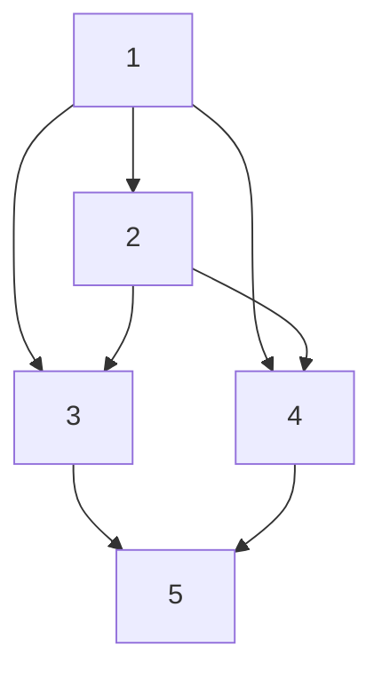
- $\deg(1)=3$
- $\deg(2)=3$
- $\deg(3)=2$
- $\deg(4)=3$
- $\deg(5)=2$

Degree sequence $(4,3,3,2,2,1)$

Sum of degrees: $4+3+3+2+2+1=15$, which is odd, contradicting the Handshaking Lemma.

Conclusion: No such graph exists.

Digraph $A={(1,2),(2,3),(3,1),(3,3),(2,1)}$
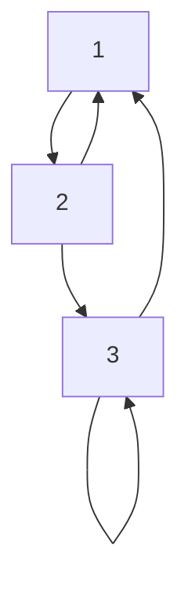
- $\deg^+(1)=1$, $\deg^-(1)=2$
- $\deg^+(2)=2$, $\deg^-(2)=1$
- $\deg^+(3)=2$, $\deg^-(3)=2$

## 4. Handshaking Lemma and Odd Vertices

Graph with 12 vertices and 17 edges:

$\sum \deg(v)=2|E|=34$

Graph with exactly 6 odd-degree vertices:
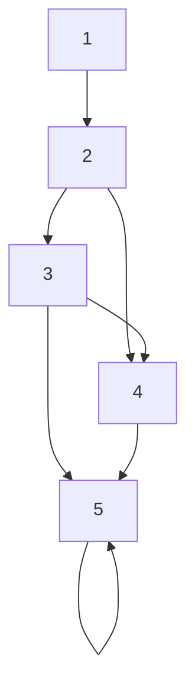
"A graph with exactly one odd-degree vertex exists."

False. By the Handshaking Lemma, the number of odd-degree vertices must be even.

## 5. Havel–Hakimi Algorithm

Sequence $(5,4,3,3,2,2,1)$ is graphical after valid reductions.

Sequence $(4,4,3,2,2,1,1)$ becomes negative during reduction → not graphical.

Example of non-graphical sequence of length 7:

$(4,4,3,2,2,1,1)$ (sum is odd → impossible).

## 6. Types of Edges

Graph with 2 loops, 3 parallel pairs, and edges in series:
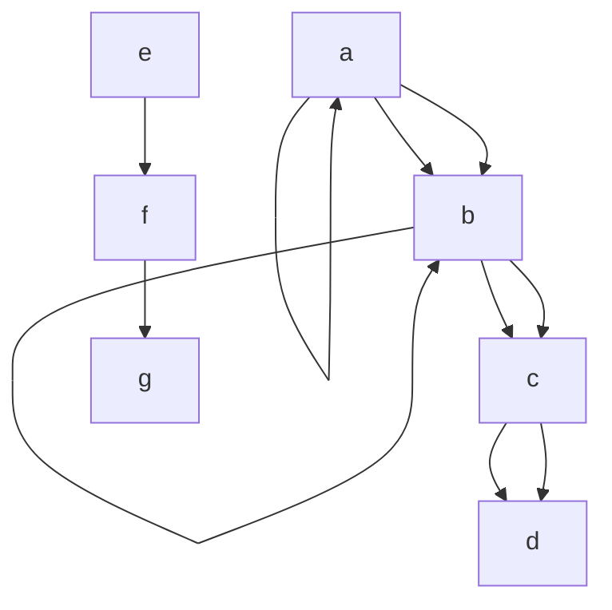
Identify loops, parallel edges, series edges:
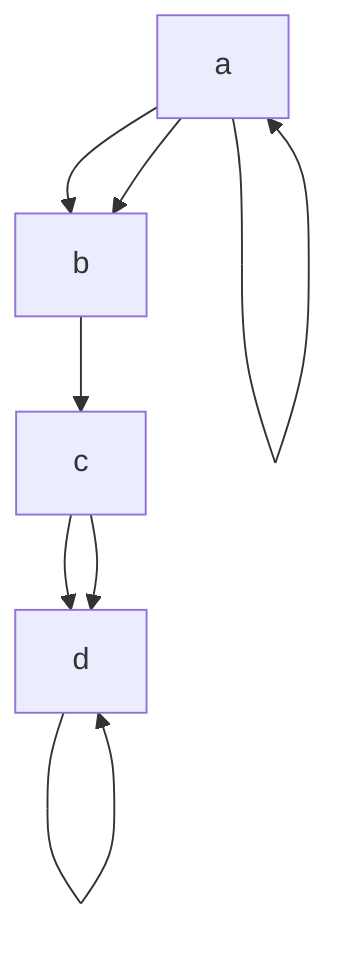
Loops: $aa$, $dd$

Parallel: $ab$, $ab$ and $cd$, $cd$

Series: $bc$

## 7. Types of Graphs

Examples:

a) Null graph (5 vertices)

b) 3-regular graph (6 vertices)
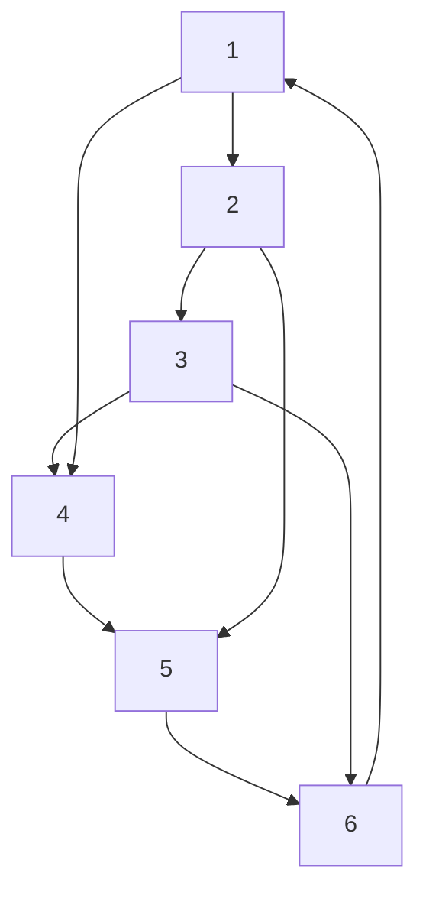
c) Connected graph (7 vertices)
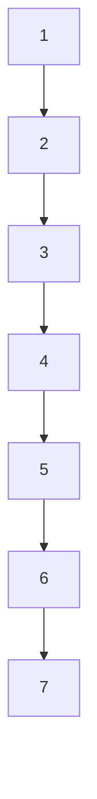
d) Bipartite non-complete graph
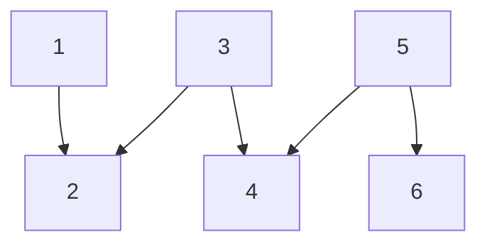
e) Complete bipartite graph $K_{3,4}$
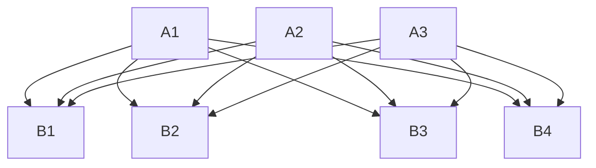
f) Tree with 10 vertices
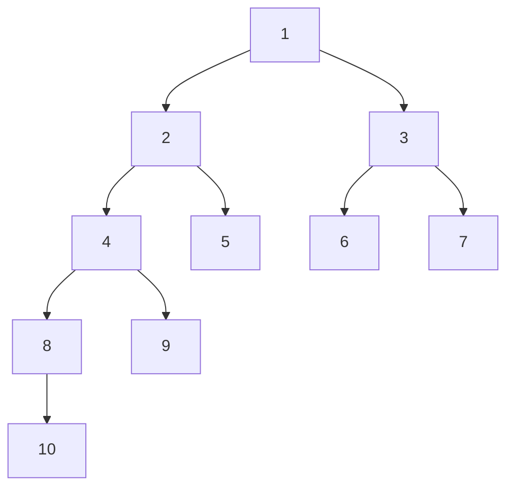
g) Forest with 8 vertices
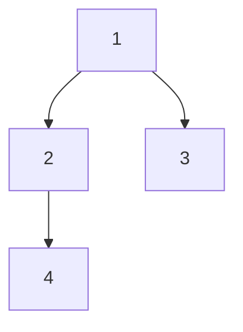
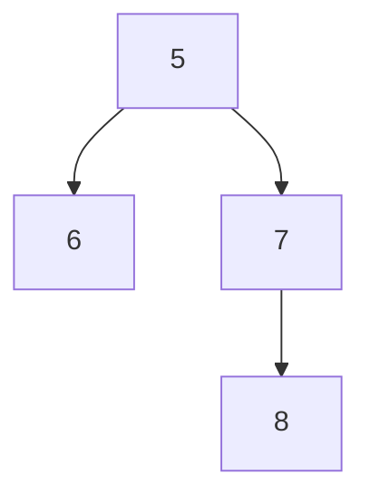

h) Multigraph with parallel edges
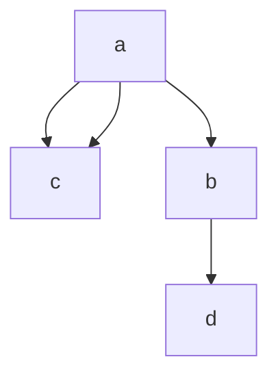
i) Pseudograph with a loop
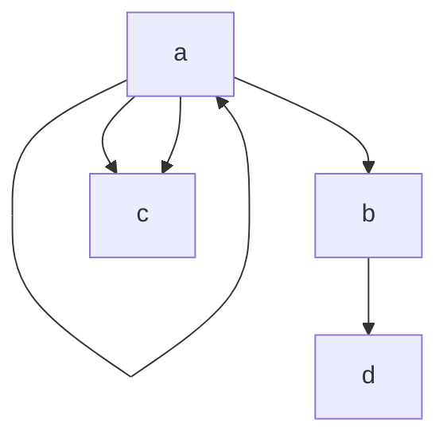
j) Subgraph
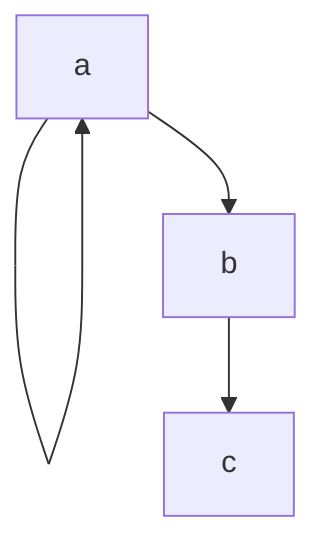
Regularity:

$(3,3,3,3,3,3)$ → regular

$(4,4,4,4,4)$ → regular

$(2,2,2,2,1,1)$ → not regular

## 8. Isomorphism

- $E_C = \\{ab,ac,bc,bd\\}$ and $E_D = \\{12,13,23,24\\}$

Graphs A and B are isomorphic via mapping $1\mapsto a$, $2\mapsto b$, $3\mapsto c$, $4\mapsto d$.

- Two non-isomorphic graphs with degree sequence $(3,3,2,2,2,2)$:

Graph 1
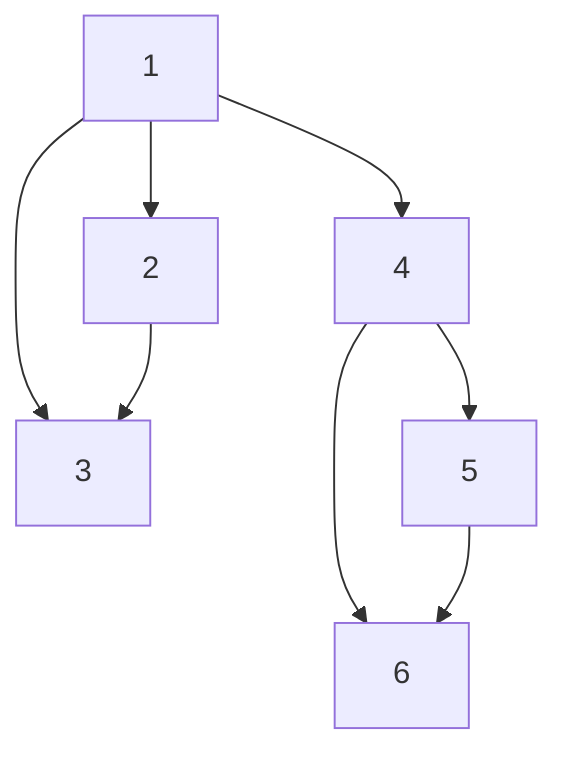

Graph 2
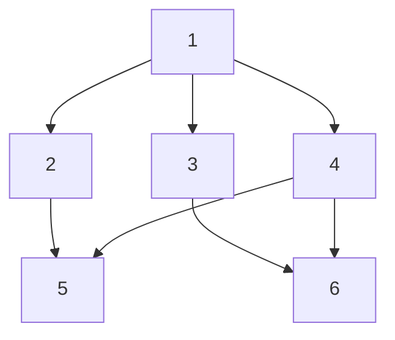

Reason: Graph 1 contains two triangles; Graph 2 contains none.

Graphs C and D are not isomorphic because edge $14$ in $E_C$ has no corresponding edge in $E_D$.

22. Determine whether the following graphs are isomorphic. If yes, provide the isomorphism; if not, justify:

    **Graph C:**  
    $\\[E_C = \\{12, 13, 14, 23\\}\\]$

    **Graph D:**  
    #\\[E_D = \\{ab, ac, bd, cd\\}\\]$

    They are not isomorphic, because the isomorphism that I can detect is $f(1)=a, f(2)=b, f(3)=c, f(4)=d$, but this breaks in the third edge where $14\in E_C$ but $ad\notin E_D$

---

## 9. Walks, Paths, and Circuits

23. In the graph  
    $$
    E = \\{ab, bc, cd, da, ac\\},
    $$
    ```mermaid
    graph TD
        a --> b
        b --> c
        c --> d
        d --> a
        a --> c
    ```
    list:  
    a) all walks of length 2 starting at $a$,  
    A walk of length 2 has the form $(a,x,y)$.
    All valid walks:
    $$
    (𝑎,𝑏,𝑐), (𝑎,𝑏,𝑎), (𝑎,𝑐,𝑏), (𝑎,𝑐,𝑑), (𝑎,𝑑,𝑐), (𝑎,𝑑,𝑎)
    $$
    b) all simple paths starting at $a$,  
    A simple path does not repeat vertices
    $$
    a, b
    a, c
    a, d
    a, b, c
    a, c, b
    a, c, d
    a, d, c
    a, b, c, d
    a, d, c, b
    $$
    c) all circuits.
    A circuit is a closed walk with no repeated edges.
    $$
    {𝑎,𝑏,𝑐,𝑑,𝑎}, {𝑎,𝑐,𝑑,𝑎}
    $$

24. Determine whether the following sequences are walks, paths, or circuits:  
    a) $(1,2,3,2,4)$
    - Repeats vertices
    - Not closed
    - Not simple
    Therefore is a walk
    b) $(a,b,c,d,a)$
    - Closed
    - No repeated vertices except start/end
    Therefore is a circuit
    c) $(x,y,z)$ with edges $\\{xy, yz, zx\\}
    - No repeated vertices
    - Not closed
    Therefore is a simple path

25. Construct a directed graph that contains:  
    - a directed walk of length 5,
    ```mermaid
    graph TD
        a --> b
        b --> c
        c --> d
        c --> e
        e --> f
    ```
    - a directed path of length 4,  
    ```mermaid
    graph TD
        a --> b
        b --> c
        c --> d
        d --> e
    ```
    - a directed circuit of length 3.
    ```mermaid
    graph TD
        a --> b
        b --> c
        c --> a
    ```

---