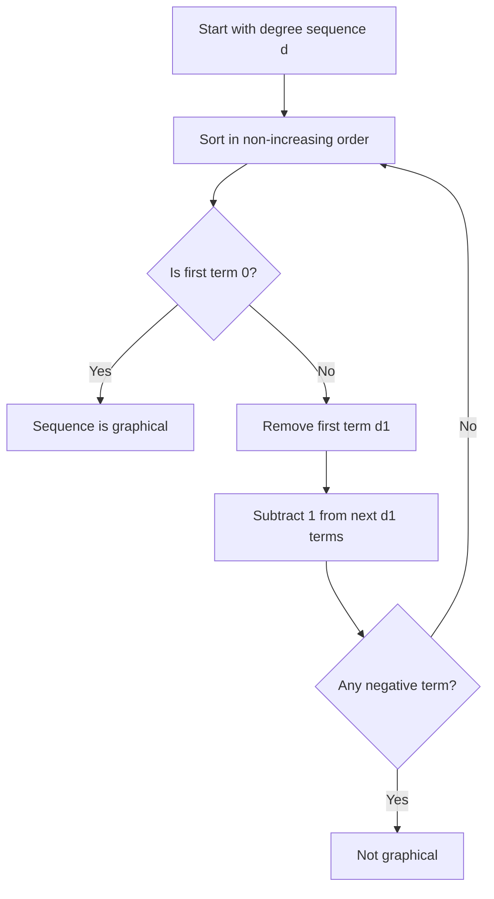
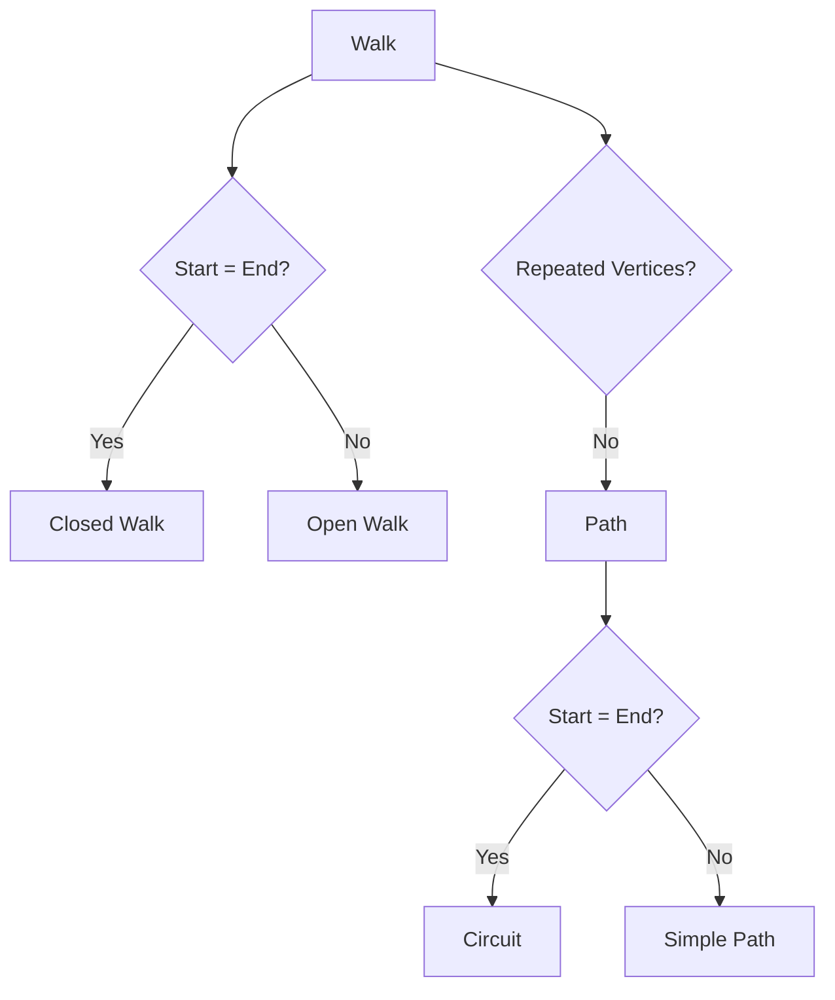
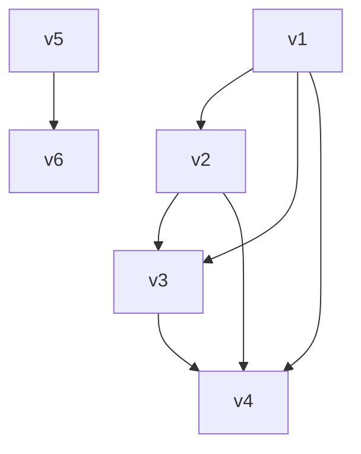

---

# **Graph Theory – Introduction to Graph Theory**

## 1. Basic Concepts

### 1.1 Graph, Digraph, Multidigraph, Pseudodigraph

#### **Definition 1.1 — Graph**
A **graph** $G = (V, E)$ consists of:
- a non-empty finite set $V$ of **vertices**, and  
- a set $E$ of **edges**, where each edge is an unordered pair of vertices.
- Example: $\\{ab, ac, bd}\\$

#### **Definition 1.2 - Pseudograph**
A **pseudograph** is a non directed graph that allows loops and parallel edges without simplicity restrictions.

#### **Definition 1.3 — Digraph**
A **directed graph** or **digraph** $D = (V, A)$ consists of:
- a set $V$ of vertices,  
- a set $A$ of **arcs**, where each arc is an ordered pair of vertices.
- Example: $\\{(a,b), (a,c), (b,d)\\}$

#### **Definition 1.4 — Multidigraph**
A **multidigraph** allows:
- multiple arcs between the same ordered pair of vertices,  
- Example: $\\{(a,b), (a,c), (b,d)\\}$

#### **Definition 1.5 — Pseudodigraph**
A **pseudodigraph** is a digraph that allows:
- loops,  
- multiple arcs,  
- and may include edges that do not follow standard incidence rules.
- Example: $\\{(a,b), (a,c), (b,d), (a,a)\\}$

Every Pseudodigraph is a Multidigraph, but not every Multidigraph is a Pseudodigraph
---

## 1.2 Incidence and Adjacency

#### **Definition 1.5 — Incidence**
An edge $e = uv$ is **incident** to vertices $u$ and $v$.

#### **Definition 1.6 — Adjacency**
Two vertices $u, v$ are **adjacent** if there exists an edge $uv \in E$.

Two edges are **adjacent** if they share a common endpoint.

---

## 1.3 Degree of a Vertex

#### **Definition 1.7 — Degree**
The **degree** of a vertex $v$, denoted $\deg(v)$, is the number of edges incident to $v$.

For digraphs:
- **In-degree**: $\deg^{-}(v)$ = number of incoming arcs  
- **Out-degree**: $\deg^{+}(v)$ = number of outgoing arcs  

---

## 1.4 Fundamental Theorems

### 1.4.1 Handshaking Lemma

#### **Theorem 1.1 — Handshaking Lemma**
For any graph $G = (V, E)$: $\sum_{v \in V} \deg(v) = 2|E|$

**Proof.**  
Each edge contributes exactly 2 to the total degree count. ∎

---

### 1.4.2 Number of Odd-Degree Vertices

#### **Corollary 1.2**
In any graph, the number of vertices of **odd degree** is **even**.

**Proof.**  
From the Handshaking Lemma, the sum of all degrees is even.  
A sum of integers is even iff the number of odd summands is even. ∎

---

### 1.4.3 Havel–Hakimi Algorithm

#### **Theorem 1.3 — Havel–Hakimi Characterization**
A sequence $d_1 \ge d_2 \ge \dots \ge d_n$ of non-negative integers is **graphical**  
(i.e., realizable as the degree sequence of a simple graph)  
iff the sequence obtained by:

1. Removing the largest degree $d_1$,  
2. Subtracting 1 from the next $d_1$ terms,  
3. Resorting the sequence,

is also graphical.

---

### **Process Diagram — Havel–Hakimi Algorithm**

---

## 1.5 Types of Edges (Directed and Undirected)

### 1.5.1 Adjacent Edges
Two edges are **adjacent** if they share a common vertex.

### 1.5.2 Parallel Edges
Two edges are **parallel** if they connect the same pair of vertices.

### 1.5.3 Loops
A **loop** is an edge that connects a vertex to itself.

### 1.5.4 Edges in Series
Two edges are **in series** if they form a path of length 2 with a common internal vertex.

---

## 1.6 Types of Graphs

### **Definition List**

- **Null graph**: A graph with no edges.  
- **Simple graph**: No loops, no parallel edges.  
- **General graph**: May include loops or parallel edges.  
- **Regular graph**: All vertices have the same degree.  
- **Connected graph**: There exists a path between every pair of vertices.  
- **Bipartite graph**: Vertex set can be partitioned into two sets with no edges inside each set.  
- **Complete graph** $K_n$: Every pair of vertices is adjacent.  
- **Tree**: Connected acyclic graph.  
- **Forest**: Disjoint union of trees.  
- **Multigraph**: Graph with parallel edges allowed.  
- **Pseudograph**: Graph with loops and possibly parallel edges.  
- **Pseudodigraph**: Directed version allowing loops and multiple arcs.  
- **Subgraph**: A graph whose vertex and edge sets are subsets of another graph.

---

## 1.7 Isomorphism

#### **Definition 1.8 — Graph Isomorphism**
Two graphs $G = (V, E)$ and $H = (V', E')$ are **isomorphic** if there exists a bijection $\\{f : V \to V' such that: uv \in E \iff f(u)f(v) \in E'\\}$

Isomorphism preserves:
- degrees  
- adjacency  
- number of edges  
- number of vertices  
- structure of walks, paths, cycles  

---

## 1.8 Walks, Paths, and Circuits

### 1.8.1 Walks

#### **Definition 1.9 — Walk**
A **walk** is a sequence of vertices  
\[
v_0, v_1, \dots, v_k
\]
such that each consecutive pair is adjacent.

- **Open walk**: $v_0 \ne v_k$  
- **Closed walk**: $v_0 = v_k$

---

### 1.8.2 Paths (Directed and Undirected)

#### **Definition 1.10 — Path**
A **path** is a walk with no repeated vertices.

- **Directed path**: all edges follow the direction of arcs.  
- **Undirected path**: edges have no direction.

---

### 1.8.3 Circuits (Directed and Undirected)

#### **Definition 1.11 — Circuit**
A **circuit** is a closed walk with no repeated edges.

- **Directed circuit**: all arcs follow their orientation.  
- **Undirected circuit**: edges are undirected.

---

## **Process Diagram — Classification of Walks**

---

# 📘 **Constructing a Graph Using the Havel–Hakimi Algorithm**

This section explains how to use the **Havel–Hakimi algorithm** not only to verify whether a degree sequence is graphical, but also to **explicitly construct a graph** that has exactly that degree sequence.

---

## 🧠 **1. General Idea of the Algorithm**

Given a degree sequence:

$$
(d_1, d_2, \dots, d_n)
$$

the algorithm:

1. Sorts the sequence in non-increasing order.  
2. Takes the first element $d_1$.  
3. Removes it.  
4. Subtracts 1 from the next $d_1$ elements.  
5. If any value becomes negative → the sequence is **not** graphical.  
6. Repeat until reaching a sequence of zeros.

---

## 🎯 **2. Interpretation for Constructing a Graph**

Every time the algorithm says:

> “Subtract 1 from the next $d_1$ elements”

this means:

> **Connect the vertex with the highest degree to the next $d_1$ vertices.**

Therefore:

- Each subtraction of 1 corresponds to **an edge you draw**.  
- By the end of the process, you will have constructed a valid graph.

---

## 🧪 **3. Complete Example**

Let us construct a graph with the degree sequence:

$$
(3,3,2,2,2,2)
$$

We denote the vertices as:

$$
v_1, v_2, v_3, v_4, v_5, v_6
$$

---

### 🔹 **Step 1**

Sorted sequence:

$$
(3,3,2,2,2,2)
$$

Vertex $v_1$ has degree 3 → we connect it to the next 3 vertices:

- $v_1 - v_2$
- $v_1 - v_3$
- $v_1 - v_4$

Subtracting:

$$
(3,2,2,2,2) \to (2,1,1,2,2)
$$

Reordering:

$$
(2,2,2,1,1)
$$

---

### 🔹 **Step 2**

Vertex $v_2$ has degree 2 → we connect it to:

- $v_2 - v_3$  
- $v_2 - v_4$

Subtracting:

$$
(2,2,1,1) \to (1,1,1,1)
$$

---

### 🔹 **Step 3**

Vertex $v_3$ has degree 1 → we connect it to:

- $v_3 - v_4$

Subtracting:

$$
(1,1,1,1) \to (0,0,1,1)
$$

Reordering:

$$
(1,1,0,0)
$$

---

### 🔹 **Step 4**

Vertex $v_5$ has degree 1 → we connect it to:

- $v_5 - v_6$

Subtracting:

$$
(1,1,0,0) \to (0,0,0,0)
$$

---

## 🎉 **4. Final Graph**

Edges obtained:

- $v_1 - v_2$
- $v_1 - v_3$
- $v_1 - v_4$
- $v_2 - v_3$
- $v_2 - v_4$
- $v_3 - v_4$
- $v_5 - v_6$

---

## 🎨 **5. Mermaid Representation**

---

## 🧩 **6. Conclusion**

The Havel–Hakimi algorithm does more than verify whether a sequence is graphical:  
👉 **it also tells you exactly how to construct the graph**.  
Each subtraction of 1 corresponds to an edge, and by following the process step by step, you obtain a valid graph that respects the degree sequence.

---
