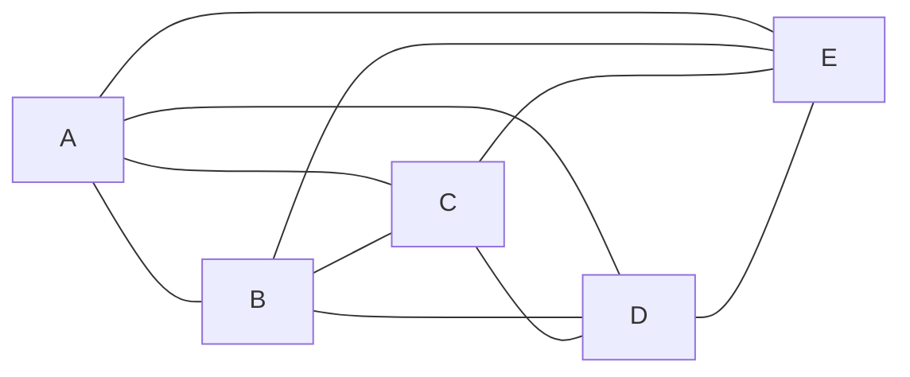
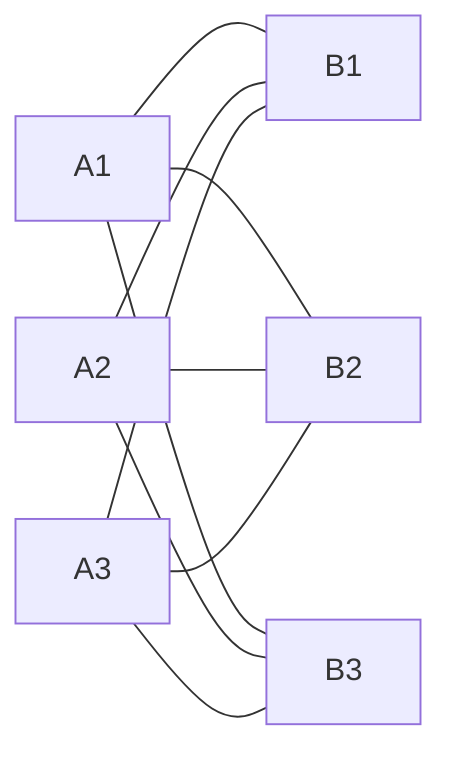
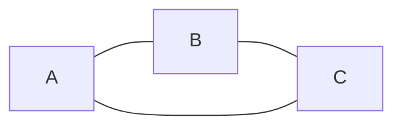
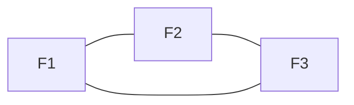

---

# **📘 Theorem Compendium — Planar Graphs**  
### *Graph Theory — Unit 6: Planar Graphs, Euler’s Formula, Kuratowski, Chromatic Number, Dual Graphs*

---

# **6.1 Planar Graphs**

## **Definition — Planar Graph**
A graph \(G\) is **planar** if it can be drawn in the plane with **no edge crossings**, except at shared endpoints.

A specific drawing with no crossings is called a **plane embedding**.

---

## **Theorem 6.1 — Characterization via Embedding**
A graph is planar **iff** it admits at least one embedding in the plane with no edge intersections.

This is a definition-equivalent theorem, but fundamental for the rest of the unit.

---

## **Lemma 6.2 — Subgraphs of Planar Graphs**
Every subgraph of a planar graph is planar.

### *Proof.*  
Removing edges or vertices cannot create crossings that were not present before. ∎

---

# **6.2 Plane Graphs**

## **Definition — Plane Graph**
A **plane graph** is a **specific drawing** of a planar graph in the plane with no crossings.

- Planar graph = abstract graph that *can* be drawn without crossings  
- Plane graph = a *particular* crossing‑free drawing  

---

## **Definition — Faces**
In a plane embedding, the regions determined by the edges are called **faces**.  
One of them is the **outer face**.

---

# **6.3 Euler’s Formula**

## **Theorem 6.3 — Euler’s Formula**
For any connected plane graph:

\[
V - E + F = 2
\]

where  
- \(V\) = number of vertices  
- \(E\) = number of edges  
- \(F\) = number of faces  

---

## **Corollary 6.4 — Edge Bound for Planar Graphs**
For any simple planar graph with \(V \ge 3\):

\[
E \le 3V - 6
\]

### *Proof.*  
Each face has degree at least 3.  
Sum of face-degrees = \(2E\).  
Thus:

\[
3F \le 2E
\]

Using Euler:

\[
V - E + F = 2 \Rightarrow F = 2 - V + E
\]

Substitute:

\[
3(2 - V + E) \le 2E
\]

\[
6 - 3V + 3E \le 2E
\]

\[
E \le 3V - 6
\]

∎

---

## **Corollary 6.5 — Bound for Triangle-Free Planar Graphs**
If a planar graph has **no triangles**, then:

\[
E \le 2V - 4
\]

### *Proof.*  
Now each face has degree ≥ 4.  
So:

\[
4F \le 2E
\]

Use Euler again and solve similarly. ∎

---

# **6.4 Kuratowski’s Theorem**

## **Theorem 6.6 — Kuratowski’s Theorem**
A graph is planar **iff** it contains **no subdivision** of:

- \(K_5\) (complete graph on 5 vertices), or  
- \(K_{3,3}\) (complete bipartite graph 3–3)

as a subgraph.

These two are the **minimal non‑planar graphs**.

---

## **Mermaid Diagrams — Forbidden Graphs**

### **\(K_5\)**

### **\(K_{3,3}\)**

---

## **Corollary 6.7 — Non‑Planarity Test**
If a graph has a subgraph homeomorphic to \(K_5\) or \(K_{3,3}\), it is non‑planar.

---

# **6.5 Chromatic Number and Chromatic Index**

## **Definition — Chromatic Number**
The **chromatic number** \(\chi(G)\) is the minimum number of colors needed to color the vertices of \(G\) so that adjacent vertices have different colors.

---

## **Definition — Chromatic Index**
The **chromatic index** \(\chi'(G)\) is the minimum number of colors needed to color the edges of \(G\) so that adjacent edges have different colors.

---

## **Theorem 6.8 — Vizing’s Theorem**
For any simple graph \(G\):

\[
\Delta(G) \le \chi'(G) \le \Delta(G) + 1
\]

where \(\Delta(G)\) is the maximum degree.

---

## **Theorem 6.9 — Planar Graph Chromatic Bound**
Every planar graph satisfies:

\[
\chi(G) \le 5
\]

This is the **Five‑Color Theorem** (weaker than the Four‑Color Theorem).

---

# **6.6 Four Color Theorem**

## **Theorem 6.10 — Four Color Theorem**
Every planar graph is **vertex‑colorable with at most 4 colors**:

\[
\chi(G) \le 4
\]

This was the first major theorem proved using a computer (Appel & Haken, 1976).

---

## **Remark**
No simple human‑checkable proof is known.  
All proofs rely on reducing to a finite set of unavoidable configurations and checking them computationally.

---

# **6.7 Dual Graphs**

## **Definition — Dual Graph**
Given a plane graph \(G\), its **dual graph** \(G^*\) is constructed by:

- placing one vertex in each face of \(G\)  
- connecting two dual vertices if their corresponding faces share an edge  

---

## **Theorem 6.11 — Dual of a Planar Graph is Planar**
If \(G\) is a plane graph, then its dual \(G^*\) is planar.

---

## **Theorem 6.12 — Dual of a Dual**
If \(G\) is a **connected** plane graph, then:

\[
(G^*)^* \cong G
\]

---

## **Mermaid Example — Dual Graph**

### **Primal Graph**

### **Dual Graph**

(Each face of the triangle corresponds to a vertex in the dual.)

---

