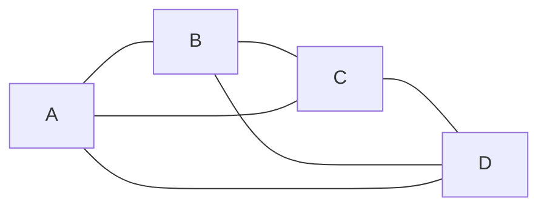
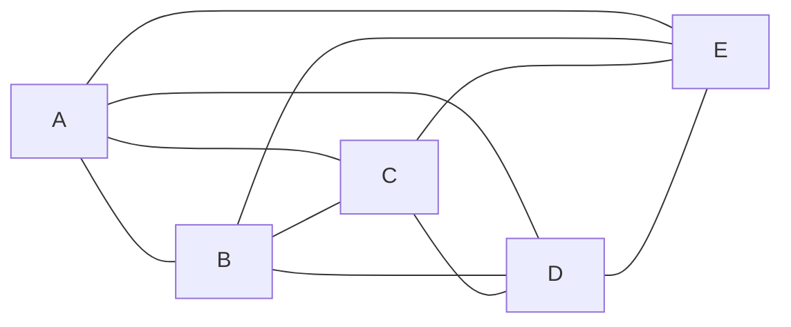
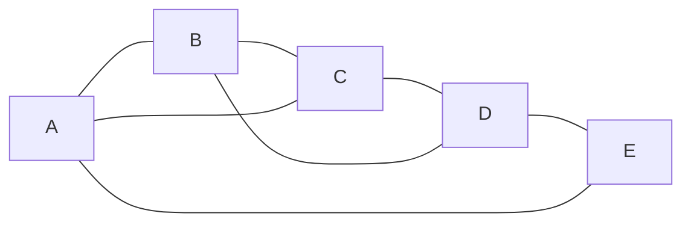
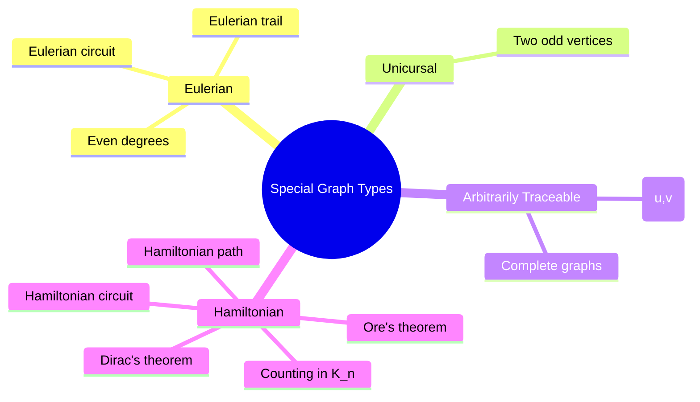

---

# **Special Types of Graphs — Theorem Collection**

## **4.1 Eulerian and Unicursal Graphs**

### **Definition — Eulerian Trail**
An **Eulerian trail** is a walk that uses **every edge exactly once**.

### **Definition — Eulerian Circuit**
An **Eulerian circuit** is an Eulerian trail that **starts and ends at the same vertex**.

### **Theorem — Characterization of Eulerian Graphs**
A connected graph \(G\) is **Eulerian** iff **every vertex has even degree**.

### **Theorem — Characterization of Unicursal (Semi‑Eulerian) Graphs**
A connected graph \(G\) has an **Eulerian trail but not a circuit** iff  
**exactly two vertices have odd degree**.

### **Mermaid Example — Eulerian Graph**

All vertices have even degree → Eulerian.

---

## **4.2 Arbitrarily Traceable Graphs**

### **Definition — Arbitrarily Traceable Graph**
A graph is **arbitrarily traceable** if **for any two distinct vertices \(u,v\)**,  
there exists a **Hamiltonian path** starting at \(u\) and ending at \(v\).

### **Theorem**
Every **complete graph \(K_n\)** with \(n \ge 2\) is arbitrarily traceable.

### **Mermaid Example — \(K_5\)**

---

## **4.3 Hamiltonian Graphs**

### **4.3.1 Hamiltonian Path and Circuit**

### **Definition — Hamiltonian Path**
A path that visits **every vertex exactly once**.

### **Definition — Hamiltonian Circuit**
A Hamiltonian path that **starts and ends at the same vertex**.

### **Dirac’s Theorem**
If \(G\) is a simple graph with \(n \ge 3\) vertices and  
\(\deg(v) \ge \frac{n}{2}\) for all vertices,  
then \(G\) is Hamiltonian.

### **Ore’s Theorem**
If for every pair of non‑adjacent vertices \(u,v\):  
\(\deg(u) + \deg(v) \ge n\),  
then \(G\) is Hamiltonian.

### **Mermaid Example — Hamiltonian Cycle**

A Hamiltonian cycle is:  
\(A \to B \to C \to D \to E \to A\)

---

## **4.3.2 Number of Hamiltonian Circuits in a Complete Graph**

### **Theorem — Number of Hamiltonian Circuits in \(K_n\)**
The number of distinct Hamiltonian circuits in the complete graph \(K_n\) is:

\[
\frac{(n-1)!}{2}
\]

- \((n-1)!\) counts all permutations fixing the starting vertex.
- Divide by 2 because cycles are reversible.

### **Example**
For \(K_5\):

\[
\frac{(5-1)!}{2} = \frac{24}{2} = 12
\]

---

## **4.4 Number of Circuits in a Hamiltonian Graph**

### **Theorem**
If a graph \(G\) is Hamiltonian, the number of Hamiltonian circuits depends on:
- its **structure**,  
- the **presence of chords**,  
- and **symmetries**.

There is **no closed formula** for general Hamiltonian graphs.

### **Example — Graph With Multiple Hamiltonian Circuits**

Hamiltonian circuits include:
- \(A B C D A\)
- \(A D C B A\)
- \(A B D C A\)
- \(A C B D A\)

---

## **4.5 Applications**

### **Eulerian Applications**
- **Route optimization** (postal delivery, garbage collection)
- **DNA sequencing** (Eulerian paths in de Bruijn graphs)
- **Network maintenance** (traversing all edges)

### **Hamiltonian Applications**
- **Traveling Salesman Problem (TSP)**
- **Genome assembly** (Hamiltonian paths in overlap graphs)
- **Robotics** (coverage paths)
- **Scheduling and routing**

### **Arbitrarily Traceable Graphs**
- **Complete communication networks**
- **Fully flexible routing systems**

---

## **Bonus: Summary Diagram (Mermaid Mindmap)**

---

