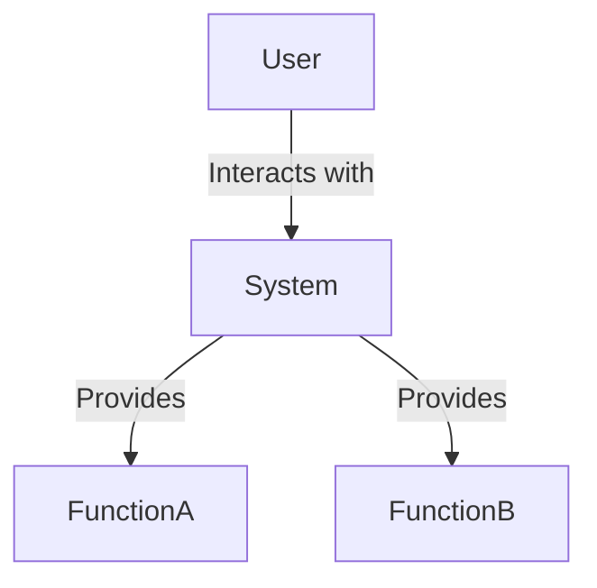
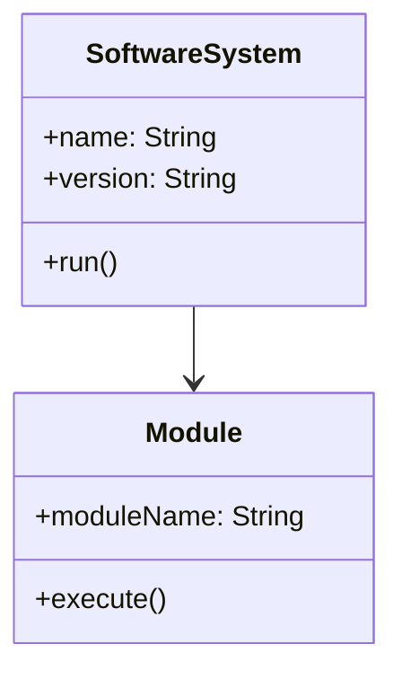
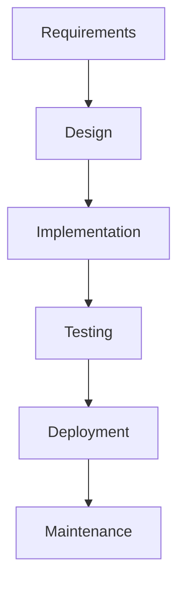
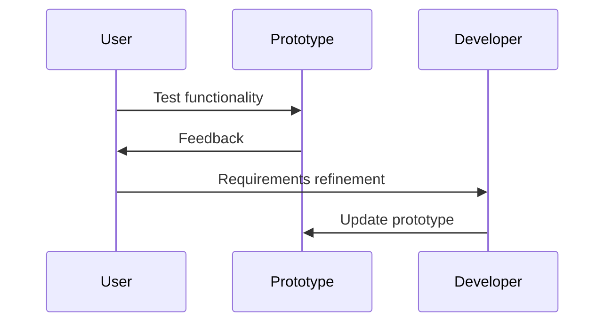
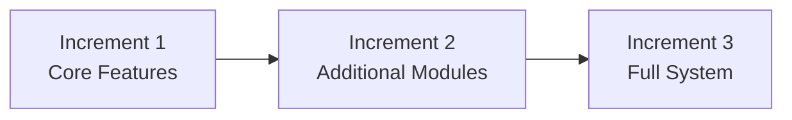
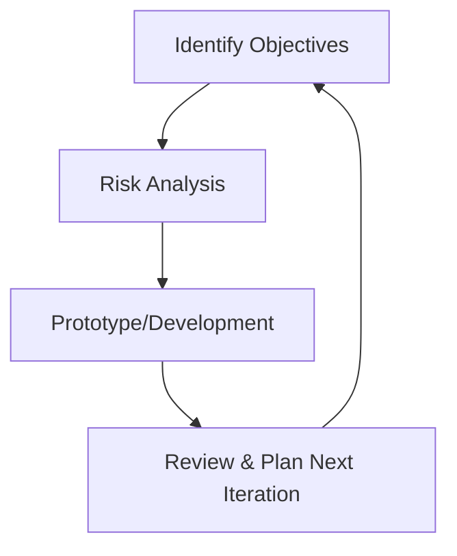
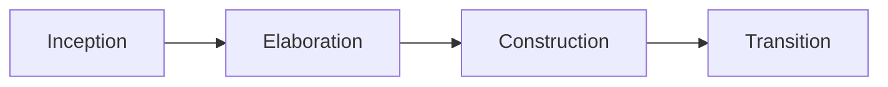
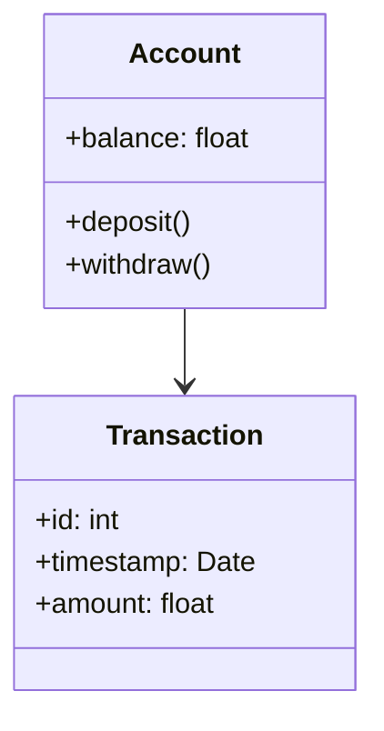
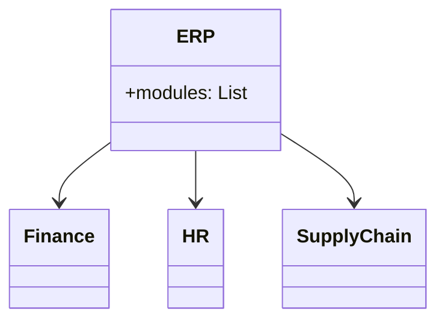
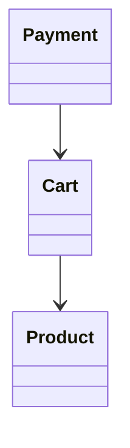

---

# **Introduction to Software Engineering**

## **1.1 Fundamental Concepts of Software Engineering**

### **Definition**
Software Engineering is the systematic, disciplined, and quantifiable approach to the development, operation, and maintenance of software systems.

### **Key Principles**
- Systematic and methodical development  
- Quality assurance and continuous improvement  
- Lifecycle orientation  
- Documentation as a core artifact  
- Collaboration and defined roles  
- Maintainability and scalability  

### **Core Activities**
- Requirements engineering  
- System and software design  
- Implementation  
- Verification and validation  
- Deployment  
- Maintenance  

---

## **UML Overview (for this section)**

### **Basic UML Use Case Diagram**

### **Basic UML Class Diagram**

---

## **Extraordinary‑Level Exercises (Section 1.1)**

1. Explain why software engineering is considered an engineering discipline and not just programming.  
2. Describe three risks that arise when software is developed without a defined process.  
3. Given a poorly documented legacy system, propose a strategy to recover its architecture.  
4. Identify five quality attributes and propose measurable indicators for each.

---

# **1.2 Software Production Processes (SDLC)**

A Software Development Life Cycle defines the phases, activities, and deliverables required to build and maintain software.

### **Common SDLC Phases**
1. Requirements analysis  
2. System and software design  
3. Implementation  
4. Testing  
5. Deployment  
6. Maintenance  

---

# **1.2.1 Waterfall Model**

### **Description**
A linear, sequential model where each phase must be completed before the next begins.

### **UML Activity Diagram (Waterfall)**

### **Example**
A government payroll system where requirements are fixed by law.

### **Extraordinary‑Level Exercises**
1. Identify two real‑world projects where Waterfall is the most appropriate model.  
2. Explain why Waterfall fails in environments with evolving requirements.  

---

# **1.2.2 Prototyping Model**

### **Description**
A prototype is built to clarify requirements before full development.

### **UML Sequence Diagram (Prototype Interaction)**

### **Example**
A mobile app UI mockup for early usability testing.

### **Exercises**
1. Describe the risks of evolving a prototype directly into the final system.  
2. Explain when throwaway prototyping is preferable to evolutionary prototyping.

---

# **1.2.3 Incremental Model**

### **Description**
The system is developed in increments; each increment adds functionality.

### **UML Diagram (Incremental Releases)**

### **Example**
A messaging app where chat is released first, then media sharing, then calls.

### **Exercises**
1. Explain how incremental development reduces project risk.  
2. Propose an incremental plan for an online learning platform.

---

# **1.2.4 Evolutionary Model**

### **Description**
Software evolves through repeated cycles of refinement.

### **Example**
AI‑based systems where requirements evolve with user feedback.

### **Exercises**
1. Explain why evolutionary models are ideal for AI‑driven systems.  
2. Describe how continuous user involvement affects system architecture.

---

# **1.2.5 Spiral Model**

### **Description**
A risk‑driven model combining prototyping and iterative development.

### **UML Spiral Diagram (Conceptual)**

### **Example**
Large‑scale defense systems with high uncertainty and risk.

### **Exercises**
1. Identify three types of risks that Spiral explicitly mitigates.  
2. Explain why Spiral is unsuitable for small projects.

---

# **1.2.6 Rational Unified Process (RUP)**

### **Description**
A disciplined, iterative software engineering framework.

### **UML Diagram (RUP Phases)**

### **Example**
Enterprise‑level systems requiring strong architecture and documentation.

### **Exercises**
1. Explain the role of use cases in RUP.  
2. Describe how RUP manages architectural risks.

---

# **1.3 Software Engineering Products**

---

# **1.3.1 Transactional Systems**

### **Description**
Systems that process large volumes of structured, repetitive transactions.

### **Example**
Banking systems, ATM networks, POS systems.

### **UML Class Diagram**

### **Exercises**
1. Explain why ACID properties are essential in transactional systems.  
2. Design a UML class diagram for a POS system.

---

# **1.3.2 Integrated Management Systems (ERP)**

### **Description**
Systems that integrate business processes across an organization.

### **Example**
SAP, Oracle ERP, Microsoft Dynamics.

### **UML Diagram**

### **Exercises**
1. Explain the role of a centralized database in ERP systems.  
2. Identify three risks of ERP implementation.

---

# **1.3.3 Decision Support Systems (DSS)**

### **Description**
Systems that assist in decision‑making using data, models, and analytical tools.

### **Example**
Forecasting tools, optimization systems, BI dashboards.

### **Exercises**
1. Explain the difference between DSS and MIS.  
2. Propose a DSS for hospital resource allocation.

---

# **1.3.4 E‑Commerce Systems**

### **Description**
Systems that support online commercial transactions.

### **Example**
Amazon, Mercado Libre, Shopify.

### **UML Diagram**

### **Exercises**
1. Describe three security threats in e‑commerce systems.  
2. Design a checkout workflow using UML activity diagrams.

---

# **1.3.5 Knowledge Management Systems (KMS)**

### **Description**
Systems that capture, store, and distribute organizational knowledge.

### **Example**
Corporate wikis, expert systems, knowledge bases.

### **Exercises**
1. Explain how KMS improves organizational learning.  
2. Propose a KMS for a university research department.

---
