---

# 🧩 Acordeón de **Ingeniería de Software**  

---

# 1. **Introducción a la Ingeniería de Software**

## 1.1 Conceptos fundamentales
- Ingeniería de Software = disciplina para **desarrollar, operar y mantener software** con calidad.  
- Crisis del software → sobrecostos, retrasos, mala calidad.  
- Software = programas + datos + documentación.

---

## 1.2 Procesos de producción de software (SDLC)

### **1.2.1 Modelo en Cascada**
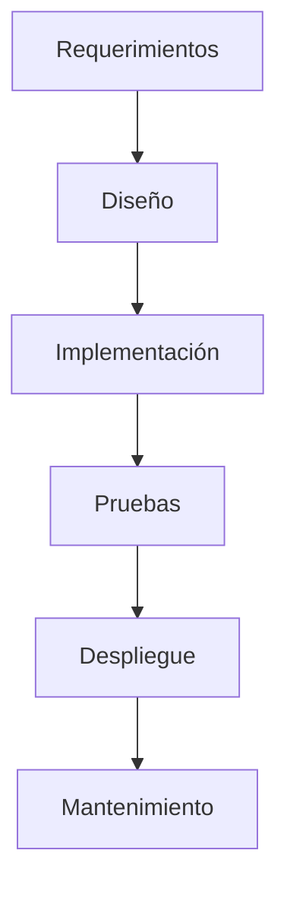

### **1.2.2 Modelo de Prototipos**
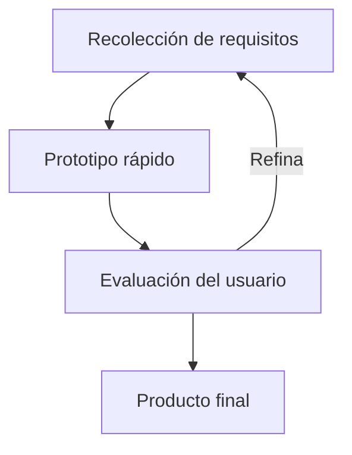

### **1.2.3 Modelo Incremental**
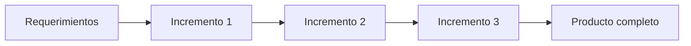

### **1.2.4 Modelo Evolutivo**
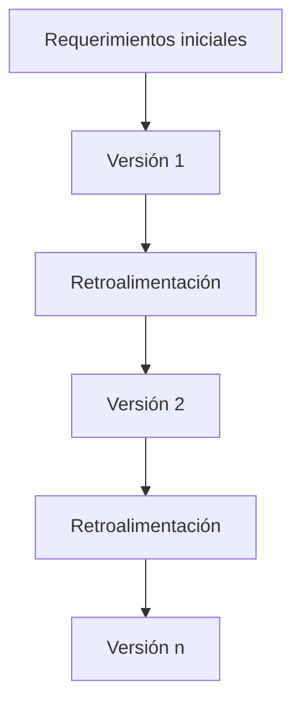

### **1.2.5 Modelo Espiral**
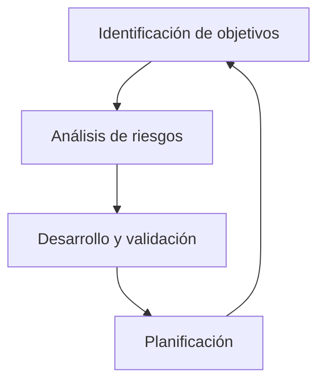

### **1.2.6 RUP (Rational Unified Process)**
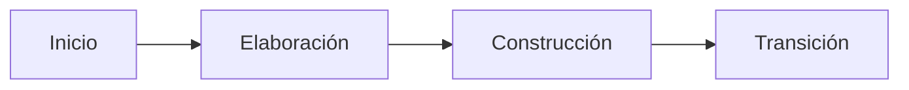

---

## 1.3 Productos de la Ingeniería de Software
- Sistemas transaccionales  
- Sistemas integrados de gestión (ERP)  
- Sistemas de apoyo a decisiones  
- Comercio electrónico  
- Gestión del conocimiento  

---

# 2. **Administración de Proyectos de Software**

## 2.1 Etapas
- Inicio  
- Planeación  
- Ejecución  
- Control  
- Cierre  

## 2.2 Áreas clave (PMI)
- Alcance  
- Tiempo  
- Costo  
- Calidad  
- Recursos humanos  
- Comunicación  
- Riesgos  
- Abastecimiento  
- Integración  

## 2.3 Estimación
- Puntos de función  
- Complejidad por casos de uso  

---

# 3. **Ingeniería de Requerimientos**

## 3.1 Tipos
- Funcionales  
- No funcionales  

## 3.2 Técnicas de recolección
- Entrevistas  
- Cuestionarios  
- Lluvia de ideas  
- Prototipos  
- Casos de uso  

## 3.3 Documento SRS (IEEE 830)
- Correcto  
- No ambiguo  
- Completo  
- Consistente  
- Verificable  
- Modificable  

---

# 4. **Modelado**

## 4.1 Modelos
- Contexto  
- Comportamiento  

---

## 4.2 Diagramas (con ejemplos Mermaid)

### **4.2.1 DFD (Nivel 0)**
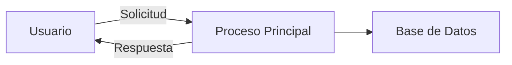

### **4.2.2 Diagrama de Actividades**
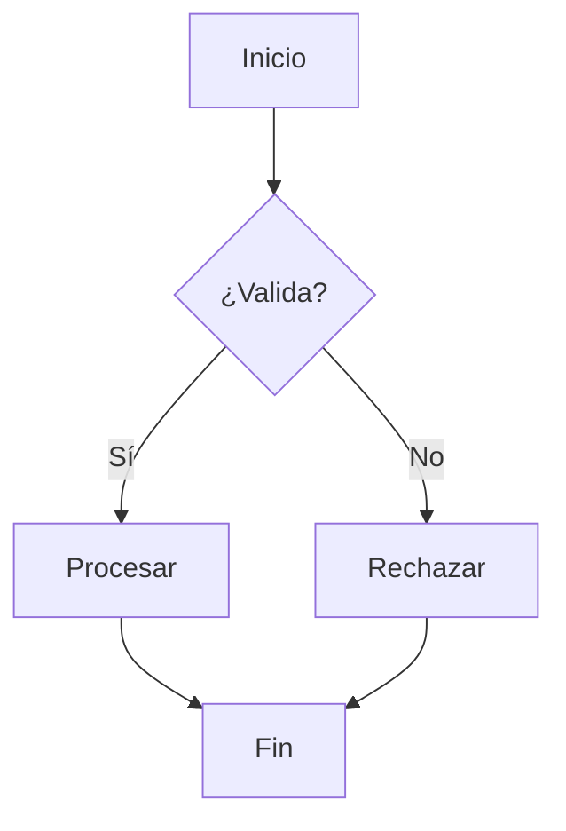

### **4.2.3 Diagrama de Secuencia**
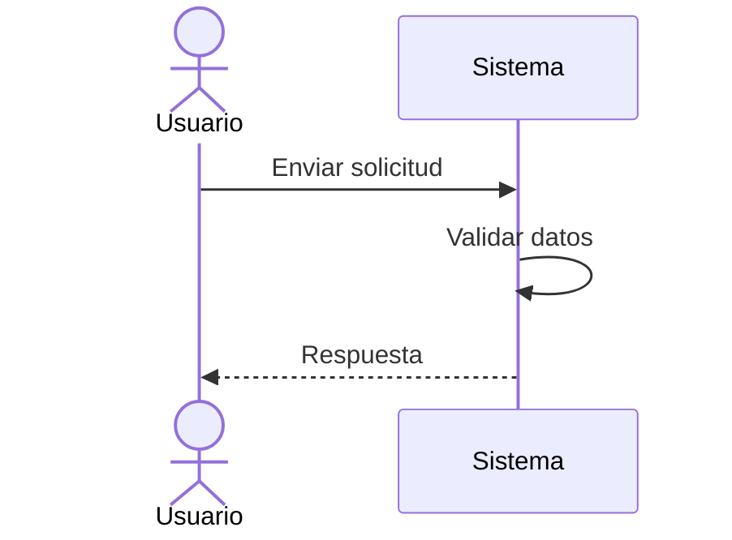

### **4.2.4 Diagrama de Clases**
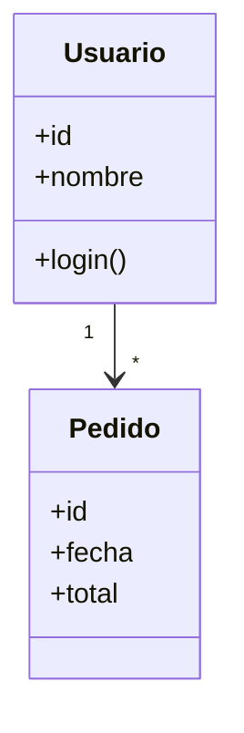

### **4.2.5 Diagrama de Estados**
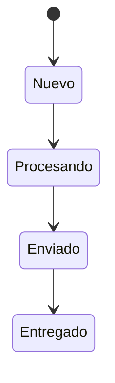

---

# 5. **Diseño de Software**

## 5.1 Diseño arquitectónico
- MVC  
- Microservicios  
- Cliente-servidor  
- Arquitectura en capas  

## 5.2 Diseño de interfaz
- Usabilidad  
- Accesibilidad  

## 5.3 Diseño de componentes
- Cohesión alta  
- Acoplamiento bajo  

## 5.4 Diseño de implementación
- Diagrama de despliegue  

---

# 6. **Verificación, Validación y Pruebas**

## 6.1 V&V
- Verificación → ¿lo construimos bien?  
- Validación → ¿construimos lo que se necesitaba?  

## 6.2 Caja blanca
- Ruta básica  
- Condiciones  
- Ciclos  
- Flujo de datos  

## 6.3 Caja negra
- Clases de equivalencia  
- Pairwise  
- Aleatoria  

## 6.4 Tipos de pruebas
- Unidad  
- Integración  
- Sistema  
- Seguridad  
- Estrés  
- Desempeño  

---

# 7. **Estándares y Mejores Prácticas**

- CMMI  
- MoProsoft  
- NYCE  
- Scrum, XP, Kanban  
- COBIT  
- ITIL  

---

# 🎯 **Resumen para examen**
- Aprende los **modelos de proceso** y sus diferencias.  
- Memoriza **propiedades del SRS**.  
- Domina **diagramas UML básicos**.  
- Ten claro **patrones arquitectónicos**.  
- Repasa **tipos de pruebas**.  
- Conoce **CMMI, MoProsoft, ITIL, COBIT** a nivel conceptual.  

---

